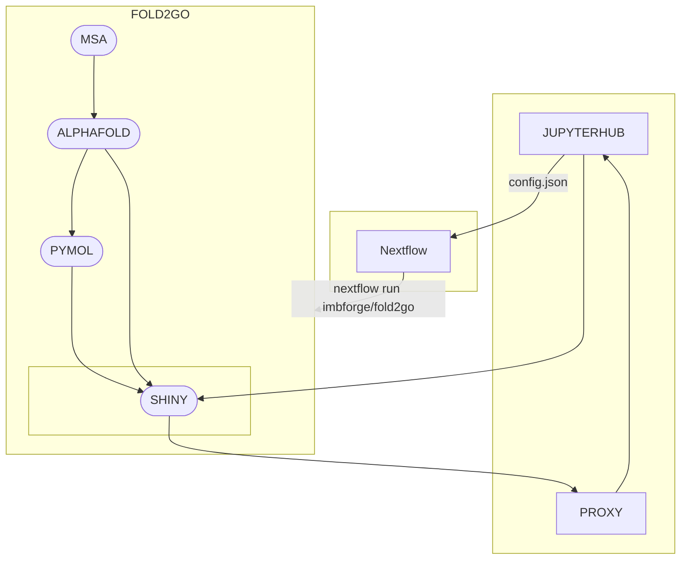

# fold2go

## Description

This is a Nextflow pipeline to run AlphaFold2 multimer on IMB infrastructure.
Multiple sequence alignments have been factored out to avoid blocking GPU resources with CPU workloads.
The pipeline also implements a Shiny (python) app to serve as a graphical frontend.

## Overview



## Testing the frontend

Until Jupyterhub is deployed properly at IMB, this repository contains configuration to spin up a Jupyterhub server.

:warning: please use this for testing purposes *only* :warning:

### Step-by-step

This assumes you are connected to `hpcgpu.imb.uni-mainz.de` via `ssh`.

#### Prerequisites

We will use [pixi](https://pixi.sh) to resolve dependencies, it needs to be installed first:

```bash
curl -fsSL https://pixi.sh/install.sh | bash
```

The pipeline itself needs access to the gitlab container registry, for that create a [personal access token](https://docs.gitlab.com/ee/user/profile/personal_access_tokens.html#create-a-personal-access-token) and use it to authenticate via singularity:

```bash 
singularity remote login -u $LOGNAME docker://registry.gitlab.rlp.net
```

#### 1) Clone the repository to your home directory:

```bash
git clone git@gitlab.rlp.net:imbforge/fold2go.git ~/fold2go
cd ~/fold2go
```

#### 2) Start Jupyterhub (dependencies will be installed to your current directory automatically, hence it might take a few minutes)

```bash
pixi run imb-alphafold
```

#### 3) Once you see something like `JupyterHub is now running at http://:42420` in your terminal output, the server should be up and running.

Open your browser and go to `https://hpcgpu.imb.uni-mainz.de:42420`, if that doesn't work try forwarding the port to your local device:

```bash
ssh -NL 42420:localhost:42420 hpcgpu.imb.uni-mainz.de
```

You should now be able to access Jupyterhub by entering `localhost:42420` in your browser address field.

#### 4) Login

Use the username of your cluster account, you can choose a password on first login, it will be saved in a database in your home directory.
