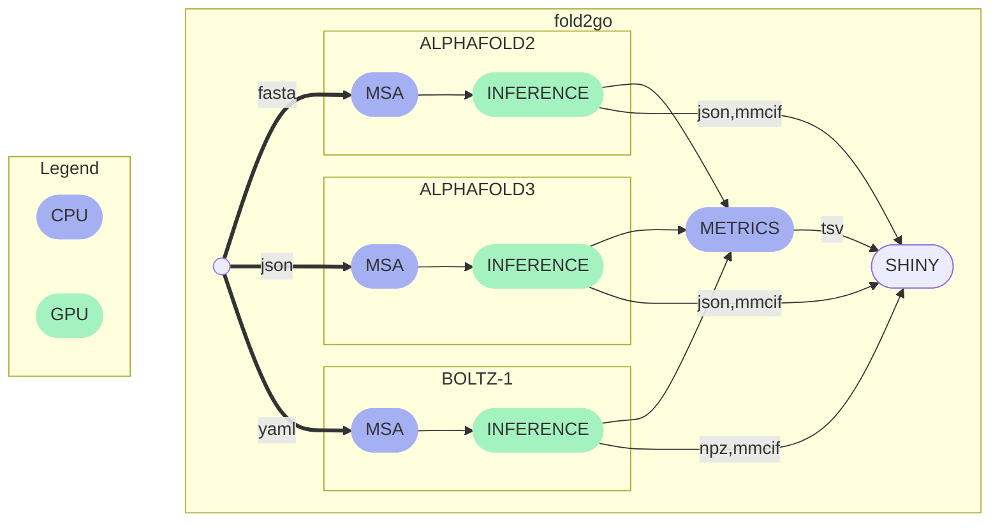

# fold2go

## Description

`fold2go` is a Nextflow pipeline for *in silico* prediction of three-dimensional protein structures through various machine learning models.

It currently supports `AlphaFold2`[^1], `AlphaFold-Multimer`[^2], `AlphaFold3`[^3] and `Boltz-1`[^4] predictions and is fully containerised.

Moreover, it accumulates and computes various metrics and contains a `py-shiny` application that allows to track pipeline progress and explore results interactively. Three-dimensional visualization of predicted structures therein is implemented via `Mol* Viewer`[^5].

> :warning: 
AlphaFold3 has a restrictive license and the model weights have to be requested from Google DeepMind. Usage is subject to their [Terms of Use](https://github.com/google-deepmind/alphafold3/blob/main/WEIGHTS_TERMS_OF_USE.md).

### Overview



## Usage

### Command Line Interface

```
nextflow run imbforge/fold2go --help
```

## Graphical User Interface

This pipeline can be launched through a Jupyterhub-based graphical frontend. If you want to try this out, head over to [imb-alphafold](https://gitlab.rlp.net/imbforge/imb-alphafold).

## References

[^1]:
    ```
    @Article{AlphaFold2021,
    author  = {Jumper, John and Evans, Richard and Pritzel, Alexander and Green, Tim and Figurnov, Michael and Ronneberger, Olaf and Tunyasuvunakool, Kathryn and Bates, Russ and {\v{Z}}{\'\i}dek, Augustin and Potapenko, Anna and Bridgland, Alex and Meyer, Clemens and Kohl, Simon A A and Ballard, Andrew J and Cowie, Andrew and Romera-Paredes, Bernardino and Nikolov, Stanislav and Jain, Rishub and Adler, Jonas and Back, Trevor and Petersen, Stig and Reiman, David and Clancy, Ellen and Zielinski, Michal and Steinegger, Martin and Pacholska, Michalina and Berghammer, Tamas and Bodenstein, Sebastian and Silver, David and Vinyals, Oriol and Senior, Andrew W and Kavukcuoglu, Koray and Kohli, Pushmeet and Hassabis, Demis},
    journal = {Nature},
    title   = {Highly accurate protein structure prediction with {AlphaFold}},
    year    = {2021},
    volume  = {596},
    number  = {7873},
    pages   = {583--589},
    doi     = {10.1038/s41586-021-03819-2}
    }
    ```

[^2]:
    ```
    @article {AlphaFold-Multimer2021,
    author       = {Evans, Richard and O{\textquoteright}Neill, Michael and Pritzel, Alexander and Antropova, Natasha and Senior, Andrew and Green, Tim and {\v{Z}}{\'\i}dek, Augustin and Bates, Russ and Blackwell, Sam and Yim, Jason and Ronneberger, Olaf and Bodenstein, Sebastian and Zielinski, Michal and Bridgland, Alex and Potapenko, Anna and Cowie, Andrew and Tunyasuvunakool, Kathryn and Jain, Rishub and Clancy, Ellen and Kohli, Pushmeet and Jumper, John and Hassabis, Demis},
    journal      = {bioRxiv},
    title        = {Protein complex prediction with AlphaFold-Multimer},
    year         = {2021},
    elocation-id = {2021.10.04.463034},
    doi          = {10.1101/2021.10.04.463034},
    URL          = {https://www.biorxiv.org/content/early/2021/10/04/2021.10.04.463034},
    eprint       = {https://www.biorxiv.org/content/early/2021/10/04/2021.10.04.463034.full.pdf},
    }
    ```

[^3]:
    ```
    @article{Abramson2024,
    author  = {Abramson, Josh and Adler, Jonas and Dunger, Jack and Evans, Richard and Green, Tim and Pritzel, Alexander and Ronneberger, Olaf and Willmore, Lindsay and Ballard, Andrew J. and Bambrick, Joshua and Bodenstein, Sebastian W. and Evans, David A. and Hung, Chia-Chun and O’Neill, Michael and Reiman, David and Tunyasuvunakool, Kathryn and Wu, Zachary and Žemgulytė, Akvilė and Arvaniti, Eirini and Beattie, Charles and Bertolli, Ottavia and Bridgland, Alex and Cherepanov, Alexey and Congreve, Miles and Cowen-Rivers, Alexander I. and Cowie, Andrew and Figurnov, Michael and Fuchs, Fabian B. and Gladman, Hannah and Jain, Rishub and Khan, Yousuf A. and Low, Caroline M. R. and Perlin, Kuba and Potapenko, Anna and Savy, Pascal and Singh, Sukhdeep and Stecula, Adrian and Thillaisundaram, Ashok and Tong, Catherine and Yakneen, Sergei and Zhong, Ellen D. and Zielinski, Michal and Žídek, Augustin and Bapst, Victor and Kohli, Pushmeet and Jaderberg, Max and Hassabis, Demis and Jumper, John M.},
    journal = {Nature},
    title   = {Accurate structure prediction of biomolecular interactions with AlphaFold 3},
    year    = {2024},
    volume  = {630},
    number  = {8016},
    pages   = {493–-500},
    doi     = {10.1038/s41586-024-07487-w}
    }
    ```

[^4]:
    ```
    @article{wohlwend2024boltz1,
    author = {Wohlwend, Jeremy and Corso, Gabriele and Passaro, Saro and Reveiz, Mateo and Leidal, Ken and Swiderski, Wojtek and Portnoi, Tally and Chinn, Itamar and Silterra, Jacob and Jaakkola, Tommi and Barzilay, Regina},
    title = {Boltz-1: Democratizing Biomolecular Interaction Modeling},
    year = {2024},
    doi = {10.1101/2024.11.19.624167},
    journal = {bioRxiv}
    }

    @article{mirdita2022colabfold,
    title={ColabFold: making protein folding accessible to all},
    author={Mirdita, Milot and Sch{\"u}tze, Konstantin and Moriwaki, Yoshitaka and Heo, Lim and Ovchinnikov, Sergey and Steinegger, Martin},
    journal={Nature methods},
    year={2022},
    }
    ```

[^5]:

    ```
    @article{sehnal2021mol,
    title={Mol* Viewer: modern web app for 3D visualization and analysis of large biomolecular structures},
    author={Sehnal, David and Bittrich, Sebastian and Deshpande, Mandar and Svobodov{\'a}, Radka and Berka, Karel and Bazgier, V{\'a}clav and Velankar, Sameer and Burley, Stephen K and Ko{\v{c}}a, Jaroslav and Rose, Alexander S},
    journal={Nucleic acids research},
    volume={49},
    number={W1},
    pages={W431--W437},
    year={2021},
    publisher={Oxford University Press}
    }
    ```
