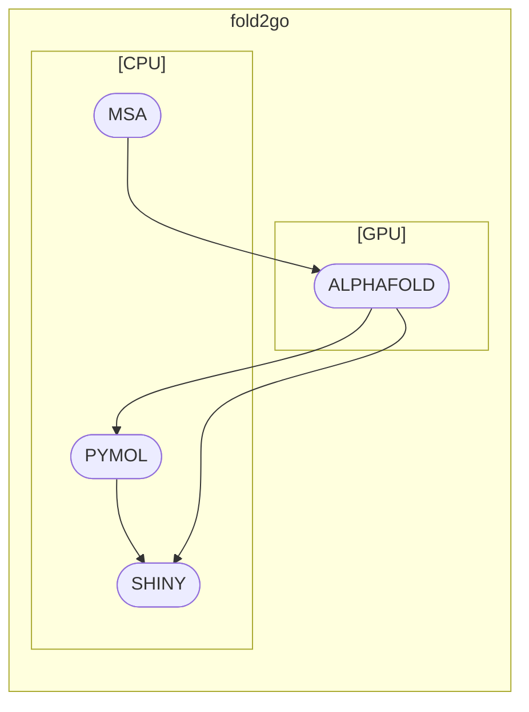

# fold2go

## Description

This is a Nextflow pipeline to run AlphaFold on IMB infrastructure. Multiple sequence alignments have been factored out to avoid blocking GPU resources with CPU workloads.
It implements a Shiny (Python) application that allows to track pipeline progress and results interactively.

## Overview

## Graphical User Interface

This pipeline can be used via an in-development Jupyterhub-based graphical frontend. If you want to try this out, head over to [imb-alphafold](https://gitlab.rlp.net/imbforge/imb-alphafold)
